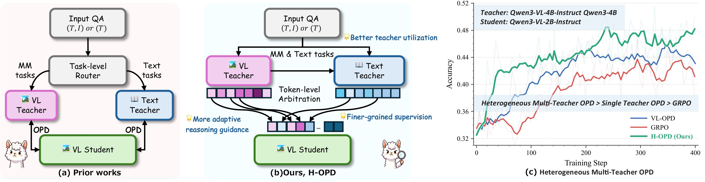

<h1> H-OPD: Confidence Aware Heterogeneous Multi-Teacher Multimodal On-policy Distillation </h1>

<h5 align="center">If you find this project useful, please give us a star🌟.</h5>

Qixiang Yin1,6, Huanjin Yao2, Cai Yuchen3, Jianghao Chen6, Ziyi Wang1, Min Yang2,*, Fei Su1,4,5, Zhicheng Zhao1,4,5,*

1 Beijing University of Posts and Telecommunications, 2 ByteDance, 3 USTC

4 Beijing Key Laboratory of Network System and Network Culture

5 Key Laboratory of Interactive Technology and Experience System, Ministry of Culture and Tourism

6 Zhongguancun Academy, Beijing, China

* Corresponding Author

## 📊 Datasets

All datasets are available on HuggingFace:

### Training Data

We train our models on **MMFineReason-123K**. Under the same experimental setting:
- We use a multimodal teacher model to generate image descriptions
- We employ GPT-4.1-mini to assess the correctness of these descriptions
- After filtering, we obtain **55K** high-quality training samples, which are used consistently across all training settings

**Filename:** `mmfine_reason_sampled_55k_text_prompt.parquet`

### Validation Data

We sample validation sets from three math reasoning benchmarks:

| Benchmark | Filename |
|-----------|----------|
| MathVerse | `mathverse_200_test.parquet` |
| MathVision | `mathvision_test.parquet` |
| MathVista | `mathvista_200_test.parquet` |

## 🎙️ News
- **`Jun 2, 2026.`** We release our paper in arxiv.
- **`Jun 2, 2026.`** We release our training dataset in github.

## 💡 About H-OPD
On-policy distillation (OPD) has recently emerged as an effective post-training paradigm by providing supervision on student-generated trajectories. 
However, existing OPD methods for multimodal reasoning usually rely on a static teacher routing, assigning each sample to a single teacher based on modality or task type. This ignores that visual grounding and abstract reasoning may dominate different decoding steps, making a single teacher insufficient for the full trajectory.
To this end, H-OPD is proposed as a confidence-aware heterogeneous multi-teacher OPD framework for multimodal reasoning. By verifying the complementarity of heterogeneous teachers in the same reasoning process, H-OPD replaces task or sample level teacher routing with token-level teacher arbitration along the shared student trajectory. H-OPD employs vision-to-language description transfer to enable text-only teachers to access key visual semantics, and uses a confidence-aware arbitration mechanism to dynamically combine vision-language teacher and text-only teachers at each token. 
Extensive evaluations over 11 widely-used reasoning benchmarks showcase the superior performance of our method.

## 🔗 Citation
If you find this repository is useful, please star🌟 this repo and cite🖇️ our paper.

## 🙏 Acknowledgment
Our work is primarily based on the following codebases. We are sincerely grateful for their work.
- [VLMEvalKit](https://github.com/open-compass/VLMEvalKit): We use VLMEvalKit for evaluation.
- [VerL](https://github.com/verl-project/verl/tree/main): We use VerL for our codebase.
